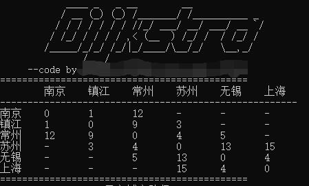

>## Dijkstra算法课设

数据结构课程中的经典算法。我会将一些程序系统设计过程中的一些小细节问题（暂且称之为小细节把，因为我也不知道拿什么次比较准确），并在最后附上程序所有源码。作为一个曾经的苟若的算法狗（现在依旧小垃圾）,很多数据结构在实现的时候没必要照抄《数据结构》书上那套迂腐的东西，那终究是伪代码，而且反人类~~当然如果你就是十分喜欢结构体的使用的话不拦着你~~。


<!--more-->

**很多东西是编程的一些编程习惯，多敲，多理解，遇到bug不要第一件事情是想着找别人问。程序员需要的是自己解决问题的能力（当然也不是一味的钻牛角尖，这就是中庸的事情了）**
~~我的某个好友问我你看到程序报错的第一反应是什么，ta的回答是问老师，我是真的无话可讲了~~


## **以下代码基于c++**

## 课设要求
1.  结点数可改变(可增加或删除城市及相关弧)
2.  弧的权值可改变(输入有弧的两个城市名称，修改相应权值)
3.  源点固定，输入不同终点时，能输出最短路径长度及路径(以城市名称表示)
4.  初始图至少包括6个城市
5.  设计简单菜单能进行操作选择

## 数据结构的选用
    
* 存储图的数据结构书上讲解了三种，这里选择的是使用实现起来最简单的邻接矩阵。
    ```
    #defin MAXSIZE 256

    int map[MAXSIZE][MAXSIZE];
    ```

    当然你也可以选择使用邻接表，那就是挑战自己的事情。邻接表的好处是在图边数较为少的时候可以用更少的存储空间,但是邻接矩阵在访问速度，效率上高很多（所谓空间换时间233）

* 邻接矩阵的初始化。
    * 因为假定城市之间是无向图，那么邻接矩阵应该是呈现出以对角线对称的趋势(因为map[x][y]的值等于map[y][x]因为我们这里认为这两个是一个路径，一个弧边)。我们把城市x到城市x自己的权值赋值为0，把城市x到城市y有路径的城市赋值为对应权值。城市间没有路径的话我们赋值权值为一个最大值0x7FFFFFFF,这又便于我们下面的Dijkstra算法进行

        
    * 当然为了打印邻接矩阵看着漂亮，在打印邻接矩阵的时候使用-代替了0x7FFFFFFF数据


    


* 还需要一个String数组来存储我们可能包含中文的城市名，数组的下标就对应邻接矩阵中的下标。
    ```
    String Citylist[MAXSIZE];
    ```

* 因为采用了邻接矩阵存储图，那么删除城市节点的时候只需要删除对应的邻接矩阵中的行和列,以及存储城市名称数组中的对应位置，增加城市节点以及修改城市节点同理，都是通过遍历城市名称遍历得到城市编号，借由编号访问位于邻接矩阵中城市之间的权值：

* 以下是删除二维矩阵（邻接矩阵中行和列的操作，以及删除城市名称数组的操作）
    ```
    void Delcol(int x) {
	    int i,j;
	    if (x>N or x<1) return;
	    for (i=1; i<=N; i++) {
	    	for (j=x; j<N; j++)
	    		map[i][j]=map[i][j+1];
    		map[i][j]=0;
    	}
    }
    void Delrow(int x) {
	    int i;
	    if (x>N or x<1) return;
	    for (i=x; i<N; i++)
		    memcpy(map[i],map[i+1],sizeof(int)*(N));
	    memset(map[i],0,N-1);
    }

    void Delname(int x) {
    	int i;
    	for (i=x; i<N; i++) CityList[i]=CityList[i+1];
    	CityList[i]= {0};
    }

    void Mapdel() {
    	int x;
    	cout<<"请输入您要删除的城市编号:";
    	cin>>x;
    	Delname(x);
    	Delcol(x);
    	Delrow(x);
    	N--;
    }
    ```

* 关于Dijkstra算法的详解
    * 首先还是从数据存储结构的设计入手。我们需要一个一维bool数组存储每个节点是否被访问过。并在寻路算法开始的时候初始化其内瓤
    * 其次，我们需要一个一维数组来存储从出发点到每个节点的路径长度
    * 最后，创建一个String数组来存储我们的路径
    * 关于Dijkstra算法理论的详解，我不是一个好老师，讲不清楚，就鸽了吧。当然数据结构的设计首先得理解算法思路。[Dijkstra算法详解(这个详解还是不错的，已经从很多提问里看出来这个博客的影子了)](https://blog.csdn.net/qq_35644234/article/details/60870719)
    

## 源码实现

### **仅供学习**
    
代码里为了完成课设某个要求智障的初始化函数还请无视(☆-ｖ-)

代码可能有很多智障的bug，毕竟也是写个课设交完报告就完事的，若有高见，还望指正。谢谢(●ˇ∀ˇ●)

```
#include<iostream>
#include<cstdio>
#include<cstring>
#include<conio.h>
#define MAXLEN 500
#define MAX 0x7FFFFFFF
using namespace std;


string CityList[MAXLEN];
int map[MAXLEN][MAXLEN]= {0};


int N;

bool check_input(int x,int y,int w,int N){
	if (w<0 || x==y || x>N || y>N || (map[x][y]!=0 && map[x][y]!=MAX)|| (map[x][y]!=0 && map[x][y]!=MAX)){
		cout<<"该组数据不符合规范，请重新输入"<<endl;
		getch();
		return true;
	}
	return false;
}

void Readin() {
	int M,x,y,w;
	memset(map,sizeof(map),0);
	cout<<"请输入城市总数:";
	cin>>N;
	cout<<"请输入路径数量:";
	cin>>M;
	
	if (M>(N+1)*N/2){
		cout<<"您输入的路径数量大于最大可能路径数量"<<endl;
		getch();
		return;
	}
	
	cout<<endl;
	for (int i=1; i<=N; i++) {
		printf("第%d个城市名称:",i);
		cin>>CityList[i];
	}
	printf("城市x编号 城市y编号 路径长度\n");
	printf("-----------------------------\n");
	for (int i=1; i<=M; i++) {
		do{
			printf("第%d组:",i);
			cin>>x>>y>>w;
		}while(check_input(x,y,w,N));
		map[x][y]=w;
		map[y][x]=w;
	}
	for (int i=1; i<=N; i++) {
		for (int j=1; j<=N; j++)
			if (i!=j && map[i][j]==0) map[i][j]=MAX;
	}
}

void Mapprint(int n=N) {
	if (N==0) return;
	cout<<"\t";
	for (int i=1; i<=n; i++) cout<<CityList[i]<<"\t";
	cout<<endl;
	for (int i=1; i<=n*9; i++) cout<<'-';
	cout<<endl;
	for (int i=1; i<=n; i++) {
		cout<<CityList[i]<<"\t";
		for (int j=1; j<=n; j++)
			if (map[i][j]!=MAX) cout<<map[i][j]<<"\t";
			else cout<<"-\t";
		cout<<endl;
	}
}

void Mapadd() {
	int n,x,y,w,m;
	cout<<"请输入增加的城市个数:";
	cin>>n;
	cout<<"请输入新增的路径个数:";
	cin>>m;
//	if (m>(N*n+(n+1)*n/2)){
//		cout<<"您输入的路径数量大于最大可能路径数量"<<endl;
//		getch();
//		return;
//	}
	cout<<endl;
	for(int i=N+1; i<=N+n; i++) {
		printf("第%d个城市的名称:",i);
		cin>>CityList[i];
	}
	printf("\n城市x编号 城市y编号 路径长度\n");
	printf("-----------------------------\n");
	for (int i=1; i<=m; i++) {
		do{
			printf("第%d组:",i); 
			cin>>x>>y>>w;
		}while (check_input(x,y,w,N+n));
		map[x][y]=w;
		map[y][x]=w;
	}
	for (int i=1;i<=N+n;i++)
		for(int j=1;j<=N+n;j++)
		if (i!=j && map[i][j]==0) map[i][j]=MAX;
	N=N+n;
}

void Delcol(int x) {
	int i,j;
	if (x>N or x<1) return;
	for (i=1; i<=N; i++) {
		for (j=x; j<N; j++)
			map[i][j]=map[i][j+1];
		map[i][j]=0;
	}
}

void Delrow(int x) {
	int i;
	if (x>N or x<1) return;
	for (i=x; i<N; i++)
		memcpy(map[i],map[i+1],sizeof(int)*(N));
	memset(map[i],0,N-1);
}

void Delname(int x) {
	int i;
	for (i=x; i<N; i++) CityList[i]=CityList[i+1];
	CityList[i]= {0};
}

void Mapdel() {
	int x;
	cout<<"请输入您要删除的城市编号:";
	cin>>x;
	Delname(x);
	Delcol(x);
	Delrow(x);
	N--;
}

void Mapmod(){
	string x,y; 
	int i,j,w;
	cout<<"请输入您要修改的两个城市的名称"<<endl;
	cout<<"城市A:"; cin>>x;
	cout<<"城市B:";	cin>>y;
	cout<<"请输入修改值(输入值<=0删除路径):"; cin>>w; 
	for (i=1;i<=N;i++)
	if (x==CityList[i]) break;
	for (j=1;i<=N;j++)
	if (y==CityList[j]) break; 
	if (i==N && CityList[i]!=x){
		cout<<"无法找到城市A"<<endl;
		getch();
		return; 
	}
	if (j==N && CityList[j]!=y){
		cout<<"无法找到城市B"<<endl;
		getch();
		return;
	}
	if (w<=0) {
		map[i][j]=MAX;
		map[j][i]=MAX;
	} 
	else{
		map[i][j]=w;
		map[j][i]=w;
	}
	
} 

bool check(bool* arr,int n){
	for (int i=1;i<=n;i++)
	if (!arr[i]) return true;
	return false;
}


void Dijkstra(){
	int d,s=1,pos,m;
	cout<<"请输入目的地城市（默认出发城市即编号为1的城市）"<<endl;
	cin>>d;
	if (d>N){
		cout<<"您输入的城市超出范围"<<endl;
		getch();
		return;
	}
	
	int dis[MAXLEN]={0};
	bool is_v[MAXLEN];
	string route[MAXLEN];
	memset(is_v,0,sizeof(bool)*MAXLEN);
	
	for (int i=1;i<=N;i++){
		dis[i]=map[s][i];
		route[i]=CityList[s]+"-->"+CityList[i];
	}
		
	dis[s]=0;
	is_v[s]=true;
	
	while (check(is_v,N)){
		pos=0;
		m=MAX;
		for (int i=1;i<=N;i++)
		if (!is_v[i] && m>dis[i]){
			m=dis[i];
			pos=i;
		}
		is_v[pos]=true;
		
		for (int i=1;i<=N;i++)
		if (!is_v[i] && dis[pos]+map[pos][i]>=0) {
			if (dis[i]>dis[pos]+map[pos][i]){
				dis[i]=dis[pos]+map[pos][i];
				route[i]=route[pos]+"-->"+CityList[i];
			}
		}
	}
	if (dis[d]==0){
		cout<<"不存在抵达该城市的路径"<<endl;
		getch();
		return; 
	}
	cout<<"最短路径长度:"; 
	cout<<dis[d]<<endl;
	cout<<route[d]<<endl;
	getch();
}

void logo(){
	system("cls");
	printf("	    ____ _   _ __        __            \n");
	printf("	   / __ \(_) (_) /_______/ /__________ _\n");
	printf("	  / / / / / / / //_/ ___/ __/ ___/ __ `/\n");
	printf("	 / /_/ / / / / ,< (__  ) /_/ /  / /_/ / \n");
	printf("	/_____/_/_/ /_/|_/____/\\__/_/   \\__,_/  \n");
	printf("	       /___/                            \n");
	cout<<"     --code by Yuuki | cc"<<endl;
	cout<<"============================================="<<endl;
	Mapprint(); 
	cout<<"============================================="<<endl;
	cout<<"	         1.录入城市路径             "<<endl;
	cout<<"	         2.增加城市路径             "<<endl;
	cout<<"		 3.编辑城市路径             "<<endl; 
	cout<<"	         4.删除城市                 "<<endl;
	cout<<"	         5.计算最短路径             "<<endl;
	cout<<"	         0.退出                     "<<endl;
}

void init(){
	N=6;
	CityList[1]="南京";
	CityList[2]="镇江";
	CityList[3]="常州";
	CityList[4]="苏州";
	CityList[5]="无锡";
	CityList[6]="上海";
	map[1][2]=1;
	map[2][1]=1;
	map[2][4]=3;
	map[4][2]=3;
	map[4][6]=15;
	map[6][4]=15;
	map[5][6]=4;
	map[6][5]=4;
	map[5][3]=5;
	map[3][5]=5;
	map[1][3]=12;
	map[3][1]=12;
	map[2][3]=9;
	map[3][2]=9;
	map[3][4]=4;
	map[4][3]=4;
	map[4][5]=13;
	map[5][4]=13;
	for (int i=1;i<=N;i++)
		for (int j=1;j<=N;j++)
		if (i!=j && map[i][j]==0) map[i][j]=MAX;
}

int main() {
	string choice;
	N=0;
	init();
	while (true){
		logo();
		cin>>choice;
		switch(choice[0]){
			case '1': Readin(); break;
			case '2': Mapadd(); break;
			case '3': Mapmod(); break;
			case '4': Mapdel(); break;
			case '5': Dijkstra(); break;
			case '0': return 0;
			default:
				continue;
		}
	}
	return 0;
}
```
    

