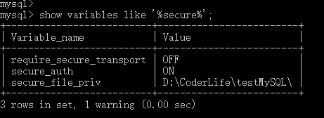
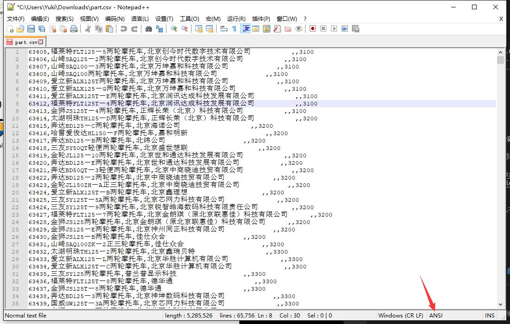
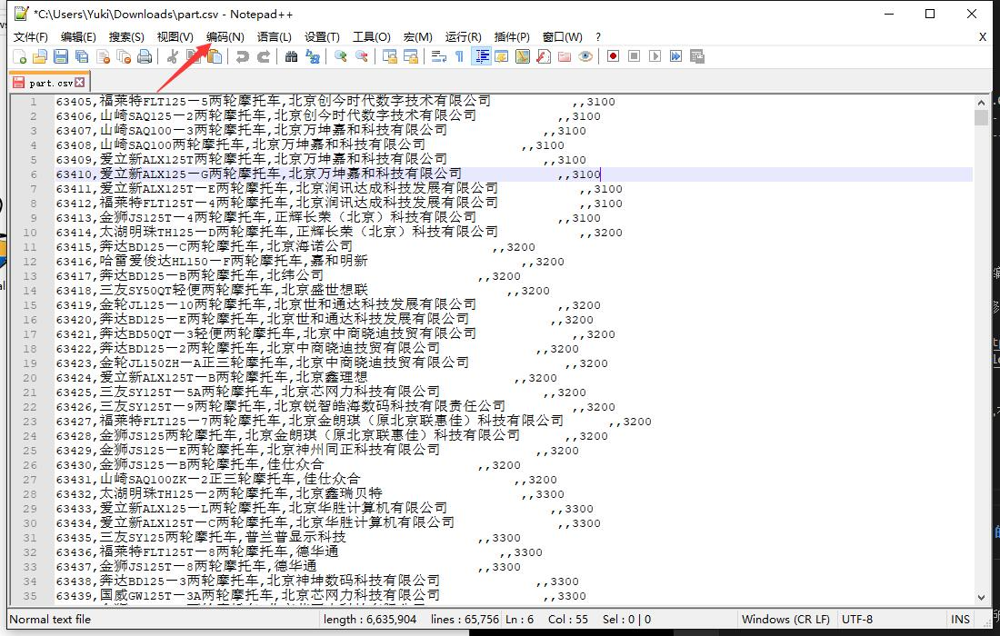

## 摘要
* 记录关于MySQL从csv文件导入数据的一些采坑记录


<!--more-->

## 什么是csv文件

* csv文件本质只是一个文本文件，它与你所见过的txt文件别无差异。（对，除了excel，你还可以用txt打开这类文件）
* csv文件（Comma-Separated Values）逗号分隔值文件格式，其文件以**纯文本**形式存储表格数据，并且以逗号分隔。

## 怎样将数据从csv导入到mysql

* ### 如果你看到如下报错
    
    ```
    The MySQL server is running with the --secure-file-priv option so it cannot execute...
    ```

    首先部分Mysql server设置中不允许你从任意路径导入数据
    
   

1. 解决这点，你只需要在mysql server的**安装路径**下修改my.ini文件，并在其中修改如下内容（划重点，安装路径！！！安装路径里必定存在bin这类似文件夹）如果你有这个文件就找到对应的地方修改，如果没有就添加（注意开头不要有井号）

    **修改文件最好备份my.ini因为如果这个文件内容错误mysql将无法启动**

    ```
    [mysqld]
    secure-file-priv="D:/CoderLife/testMySQL" 
    # 这个路径你自己可以自定义
    ```
    * 如果你的mysql安装目录下不存在这个文件，你可以尝试去C:/Program Data/MySQL/MySQL Server类似路径下寻找（Program Data文件夹是一个隐藏文件夹，请勾选显示隐藏文件以及文件夹）
    * 如果还是无法找到可以使用搜索文件功能
    * 如果完全没有这个文件(~~作者我帮忙配置mysql的那一部分人应该是完全没有这个文件的~~)，则在mysql server的安装路径下新建my.ini,内部基础内容如下
    ```
    [mysqld]
    # 这里指定你想要设置的路径，必须保证这个路径存在
    secure-file-priv="E:/test" 

    [mysql]
    default-character-set=utf8

    [client]
    default-character-set=utf8
    ```


1. 接下来重启mysql服务
    
    在具有**管理员权限**的命令行下输入如下命令
    ```
    net stop mysql
    net start mysql
    ```

1. 接下来进入数据库，输入如下命令

    ```
    show variables like "%secure%"
    ```
    如果出现的回显中包含你之前设置的路径，则表示路径修改成功过
    
    

* ### 文件字符编码问题

    要想成功导入文件，必须保证csv文件编码格式与数据库的编码格式相同。

    mysql是一个复杂的数据库，这里我们从默认编码开始修改。

1. 修改默认字符编码
    
    依旧是打开my.ini文件，修改文件内容（添加或者查找修改，依据你是创建的文件还是原来就有my.ini文件自行把握）

    修改如下三处（如果某个[xxx]标签下没有则添加）
    ```
    [client]
    default-character-set=utf8
    [mysql]
    default-character-set=utf8
    [mysqld]
    character-set-server=utf8
    ```

1. 重启mysql服务

    具有管理员权限的命令行！
    具有管理员权限的命令行！
    具有管理员权限的命令行！
    ```
    net stop mysql
    net start mysql
    ```

1. 进入数据库查看是否修改成功
    
    ```
     mysql> SHOW VARIABLES LIKE 'character%';
    +--------------------------+---------------------------------------------------------+
    | Variable_name            | Value                                                   |
    +--------------------------+---------------------------------------------------------+
    | character_set_client     | utf8                                                    |
    | character_set_connection | utf8                                                    |
    | character_set_database   | utf8                                                    |
    | character_set_filesystem | binary                                                  |
    | character_set_results    | utf8                                                    |
    | character_set_server     | utf8                                                    |
    | character_set_system     | utf8                                                    |
    | character_sets_dir       | C:\Program Files\MySQL\MySQL Server 5.0\share\charsets\ |
    +--------------------------+---------------------------------------------------------+
    8 rows in set
    ```
    出现类似如上字样表示修改成功

1. 修改csv文件的编码为utf-8

    作者本人使用的是VScode转换的编码

    你也可以使用类似的其他编辑器修改(列如notepad++)

    1. [从这里下载notepad++](https://notepad-plus-plus.org/download/)(如果你打不开就百度瞎几把找一个吧)

    1. 使用notepad++打开csv文件,右下角就会标注这个文件的编码

    

    1. 选择编码->选择转为UTF-8编码,最后保存退出即可

    

    **不建议使用txt修改，因为txt的UTF-8格式是带有BOM的，导入时依旧会报错**


* ### 导入命令问题

    仅仅使用
    ```
    LOAD DATA INFILE "file_name" INTO TABLE tbl_name
    ```
    是无法完成插入操作的，大概率会出现如下报错
    ```
    Data truncated for column xxx at row 1
    ```
    因为我们需要指定你准备导入的csv文件格式

    * 完整命令

    ```
    LOAD DATA INFILE "D:/CoderLife/testMySQL/test.csv" -- 指定csv文件路径，路径必须是我们一开始设置的
    INTO TABLE nation -- 指定你要插入的表格
    FIELDS TERMINATED BY ',' -- 指定csv文件是以逗号为分隔符
    ENCLOSED BY '"' -- 指定文本以双引号闭合
    LINES TERMINATED BY "\r\n"; -- 指定行按照如上格式换行
    ```

    * ### 拓展补充 
        * \r 回车符
        * \n 换行符
        * window环境下文本文件换行多数以“\r\n”为换行符
        * Linux环境下的文本文件换行就是以“\n”

    有关这个导入命令的详解，可以移步[这篇文章](https://blog.csdn.net/haijiege/article/details/78365063)

* ### 报错“ Duplicate entry for key ...”

    这个报错是因为你之前的表内有数据导致了主键冲突，方法删除旧的表内的内容。
    ```
    delete from table_name
    ```

* ### 报错“Row does not contain data for all columns”

    这个报错是因为csv内的数据并没有包含表的所有键值，那么这就需要在我们导入数据的时候指定导入数据数据那几列
    就是在之前上面的导入代码最后加上一个括号，里面按照csv数据列的顺序依次标注其键名
    ```
    LOAD DATA INFILE "D:/CoderLife/testMySQL/test.csv" -- 指定csv文件路径，路径必须是我们一开始设置的
    INTO TABLE nation -- 指定你要插入的表格
    FIELDS TERMINATED BY ',' -- 指定csv文件是以逗号为分隔符
    ENCLOSED BY '"' -- 指定文本以双引号闭合
    LINES TERMINATED BY "\r\n" -- 指定行按照如上格式换行
    (key1,key2,key3); -- 指定你需要导入的键
    ```
    
* ### 报错“ Incorrect integer value: xxx”
    
    这个报错是因为csv文件第一行存在着表头数据，我们可以数用如下命令忽略第一行
    ```
    LOAD DATA INFILE "D:/CoderLife/testMySQL/test.csv" -- 指定csv文件路径，路径必须是我们一开始设置的
    INTO TABLE nation -- 指定你要插入的表格
    FIELDS TERMINATED BY ',' -- 指定csv文件是以逗号为分隔符
    ENCLOSED BY '"' -- 指定文本以双引号闭合
    LINES TERMINATED BY "\r\n" -- 指定行按照如上格式换行
    IGNORE 1 LINES -- 指定忽略第一行
    (key1,key2,key3); -- 指定你需要导入的键
    ```
    
* ### 关于字符编码问题的补充
    
    其实可以通过指定导入的csv文件编码来保证字符编码问题，使用如下命令
    ```
    LOAD DATA INFILE "D:/CoderLife/testMySQL/test.csv" -- 指定csv文件路径，路径必须是我们一开始设置的
    INTO TABLE nation CHARACTER SET utf8-- 指定你要插入的表格
    FIELDS TERMINATED BY ',' -- 指定csv文件是以逗号为分隔符
    ENCLOSED BY '"' -- 指定文本以双引号闭合
    LINES TERMINATED BY "\r\n" -- 指定行按照如上格式换行
    IGNORE 1 LINES -- 指定忽略第一行
    (key1,key2,key3); -- 指定你需要导入的键
    ```
* ## 以上所有问题几乎都可以因为使用图形化界面而避免ㄟ( ▔, ▔ )ㄏ

    意不意外，刺不刺激？？？

    


        