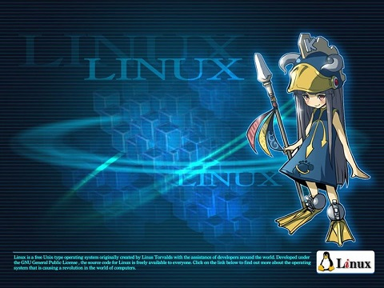

## 摘要
* Centos7 下安装mariaDB数据库的操作记录。
* MariaDB数据库是mysql的衍生版。centos发行版在centos6之后就将默认数据库改为了mariadb。[因为MySQL被甲骨文公司收购后存在闭源风险](https://www.zhihu.com/question/41832866)



<!--more-->

* 这次安装的目的，也是处于小站之后的发展考虑。

## 安装
* linux服务器，阿里云的ECS
    ```
    [root@host /]# lsb_release -a
    LSB Version:    :core-4.1-amd64:core-4.1-noarch
    Distributor ID: CentOS
    Description:    CentOS Linux release 7.6.1810 (Core)
    Release:        7.6.1810
    Codename:       Core
    ```

* 使用阿里云linux服务器默认的yum源安装，因此也没什么折腾的，简单几条命令
    ```
    yum install mariadb mariadb-server -y
    ```
## 配置
* 启动数据库
    ```
    systemctl start mariadb
    ```
* 设置数据库开机自启
    ```
    systemctl enable mariadb
    ```

* Mariadb数据库自带了初始化命令，使用命令之后以找操作进行即可。这里是使用的安全安装命令，安装过程中会提示设置密码等
    ```
    mysql_secure_installation

    以下是log记录辅以注释

    [root@host /]# mysql_secure_installation

    NOTE: RUNNING ALL PARTS OF THIS SCRIPT IS RECOMMENDED FOR ALL MariaDB
      SERVERS IN PRODUCTION USE!  PLEASE READ EACH STEP CAREFULLY!

    In order to log into MariaDB to secure it, we'll need the current
    password for the root user.  If you've just installed MariaDB, and
    you haven't set the root password yet, the password will be blank,
    so you should just press enter here.
    
    # 输入数据库root用户名密码，初始默认为空
    Enter current password for root (enter for none):
    ERROR 1045 (28000): Access denied for user 'root'@'localhost' (using password: YES)
    Enter current password for root (enter for none):
    OK, successfully used password, moving on...

    Setting the root password ensures that nobody can log into the MariaDB
    root user without the proper authorisation.
    
    # 是否设置用户名密码？ 是
    Set root password? [Y/n] Y
    New password:
    Re-enter new password:
    Password updated successfully!
    Reloading privilege tables..
    ... Success!


    By default, a MariaDB installation has an anonymous user, allowing anyone
    to log into MariaDB without having to have a user account created for
    them.  This is intended only for testing, and to make the installation
    go a bit smoother.  You should remove them before moving into a
    production environment.

    # 是否移除匿名用户？ 是
    Remove anonymous users? [Y/n] Y
    ... Success!

    Normally, root should only be allowed to connect from 'localhost'.  This
    ensures that someone cannot guess at the root password from the network.
    
    # 禁止root用户从远程登陆，仅允许本地登录 是
    Disallow root login remotely? [Y/n] Y
    ... Success!

    By default, MariaDB comes with a database named 'test' that anyone can
    access.  This is also intended only for testing, and should be removed
    before moving into a production environment.

    # 移除测试用数据库 是
    Remove test database and access to it? [Y/n] Y
    - Dropping test database...
    ... Success!
    - Removing privileges on test database...
    ... Success!

    Reloading the privilege tables will ensure that all changes made so far
    will take effect immediately.

    # 重新加载权限列表 是
    Reload privilege tables now? [Y/n] Y
    ... Success!

    Cleaning up...

    All done!  If you've completed all of the above steps, your MariaDB
    installation should now be secure.

    Thanks for using MariaDB!
    ```
* 至此，mariadb数据库的安装基本完成。[本文参考连接](https://jaminzhang.github.io/mysql/yum-install-MariaDB-in-CentOS7/)

    使用如下命令登陆数据库。
    ```
    mysql -u root -p
    ```

