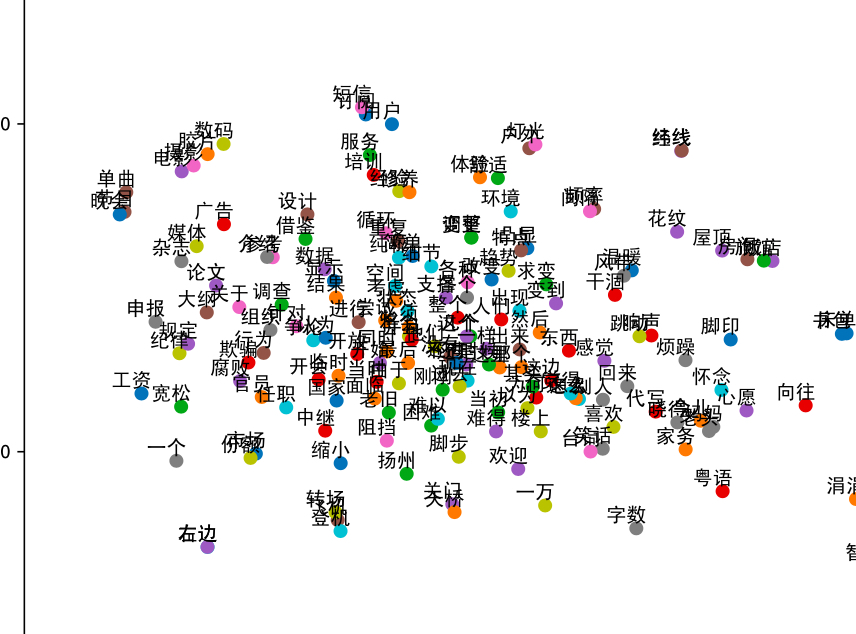

>## 概述
* 最近踩坑机器学习神经网络中的文本处理,所以有了这篇博客.记录一下基于python word2vec训练中文词向量的方法(英文也同样适用)
~~虽然事后我发现我需要的并不是词向量word2vec,而是训练获得句子向量的方法,权当做个预告吧(咕咕咕)~~

* 词向量训练:在自然语言处理中将每个单词映射到一个空间向量过程,从而获得每个词汇之间的关联性.(可能说的不太对,大概就这样吧,不是理论帝)
  


<!--more-->

## Start

* python:3.5+

1. 安装相应依赖
   ```
   pip install jieba 
   pip install gensim
   ```
   * jieba用于中文文本分词,英文可直接使用空格分割分词
   * gensim词向量训练模块

2. 数据预处理
   ```
   def load():
        with open("./train.tsv","r",encoding="utf-8") as f:
            lines=f.readlines()
            f.close()
            return lines
        return None
   ```
   这里采用的数据格式是以'\t'分割的tsv文件,每一行包含一个句子以及其对应标签.这里将二者共同训练

3. 分词并去除停止词

    * 停止词:指句子中的语气词,特殊符号,数字等对句子意义判别无帮助的词汇,这里推荐几个常用的中文停止词表,你也可以一句自己项目需要自己制作适合的停止词表[Github](https://github.com/goto456/stopwords)

    ```
    # 导入结巴分词
    import jieba

    # 读取停止词表函数,停止词表为一行一个的格式
    def load_stopwords():
        with open("./stopwords.txt","r",encoding="utf-8") as f:
            words=f.readlines()
            f.close()
            return words
        return None
    
    # 装载停止词表
    stopowrds=load_stopwords()

    # 分词去除停止词函数,lines为上一步中读取的单行数据,将所有的分词保存到文本文件中为下一步训练备用
    def cut(lines):
        with open("cutwords.txt","w+",encoding="utf-8") as f:
            for line in lines:
                words=jieba.cut(line)
                
                #去除停止词
                for i in words:
                if i in stopwords:
                    words.remove(i)
                
                f.write(" ".join(words))
                f.wirte("\n")
            
    ```

4. 模型训练
    ```
    # 导入词向量训练模块
    from gensim.models import word2vec
    from gensim.models.word2vec import LineSentence

    # 训练函数
    def model_train(
        sentence_in=sentence,   # 需要训练的数据
        size_in=300,                        # 生成的词向量维数,训练数据量越大,推荐数值越大
        window_in=5,                        # 滑动窗口大小,涉及到单个词语关联前后单词的数目
        min_count_in=2,                 # 字典截断,出现次数少于该数值的词汇会被放弃
        iter_in=5                               # 迭代次数
        ):

        print("start traing...")
        
        model=word2vec.Word2Vec(
        sentences=sentence_in,
        size=size_in,
        window=window_in,
        min_count=min_count_in,
        workers=multiprocessing.cpu_count(),
        iter=iter_in
        )
        
        print("traing complete...")
        return model
    
    # 从之前完成分词的数据中装载训练数据,模型sentence参数可以是一个list
    # 但是大批量数据时建议使用word2vec自带的类型导入
    sentence=LineSentence("./cutwords.txt")
    model=model_train(sentence,300,5,2,5)    
    ```
5. 保存模型
    ```
    # 参数为保存的文件名
    model.save("modeltest")
    ```

6. 模型的二次训练
    ```
    # 读取模型
    model = gensim.models.Word2Vec.load('modeltest')
    # 追加训练
    model.train(more_sentences)
    ```

7. 模型使用
    ```
    # 根据给定的词汇给出10个最相近的词汇
    model.most_similar("男人")

    # 找出离群词
    model.doesnt_match("测试")

    # 计算两个词汇相似度
    model.similarity('男人', '女人') 

    # 获得单个词汇的词向量
    model['男人']
    ```

