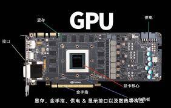
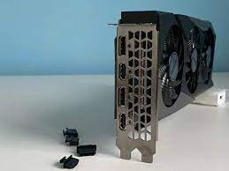
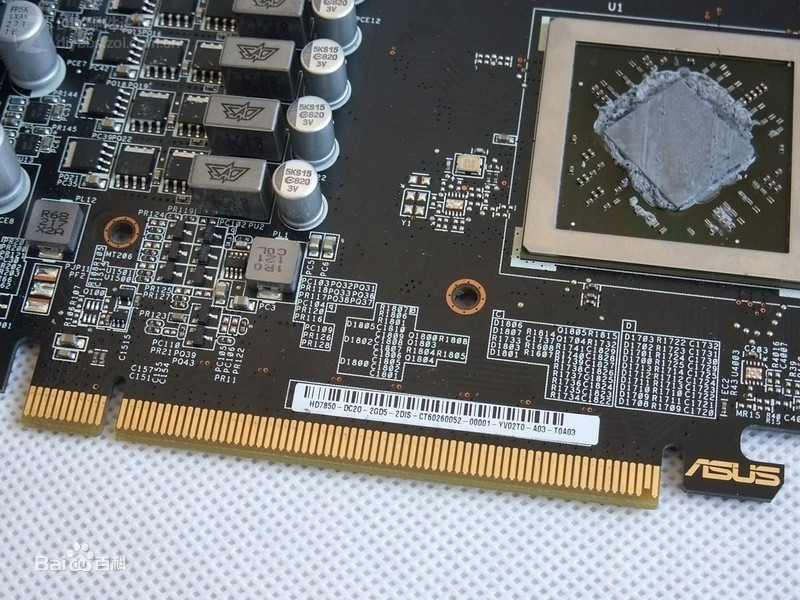
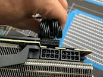
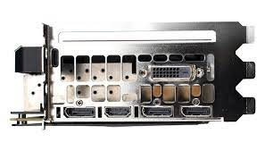
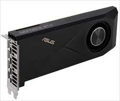

# 计算机硬件知识科普

一篇简单的计算机硬件科普文，将简单从计算机各个硬件组成来普及个人pc以及简单服务器pc的硬件组成及品牌硬件参数知识。如有纰漏还望指正。出于本文的目的，是为了向小白快速普及计算机硬件知识，所以涉及偏向学术性质的原理知识这里可能会简单一笔带过。

## 计算机的理论组成

现代计算机的结构组成脱胎于“冯 诺依曼结构”，也称为（所以冯诺依曼也被称为计算机之父），该理论计算机由如下四个部分组成：
1. 运算器
    
    运算器这里映射到现代计算机设备就是我们常规意义上的处理器（CPU）中负责数据运算的部分
2. 控制器
    
    控制器在现代计算机设备中被集成在处理器（CPU）中，简单讲其功能是负责指挥，控制指令的执行。
3. 存储器
   
   存储设备顾名思义，负责数据的存储，泛指各类存储，缓存等等。我们可以把电脑内存，硬盘等归类为存储器
4. 输入设备

    输入设备，是人与计算机交互的设备，在早期计算机中人们采用[打孔纸带](https://baike.baidu.com/item/%E7%A9%BF%E5%AD%94%E7%BA%B8%E5%B8%A6/1234150?fromModule=search-result_lemma)的方式与计算机交互。在现代计算机中，鼠标键盘，触摸屏（触摸这个特性），以及未来可能出现的脑机接口等都可以归类为输入设备。
5. 输出设备
    
    输出设备这里常规包括最基础的显示器。当然打印机等也可以算作输出设备。

## 计算机真实硬件组成

讨论完理论性质上的组成，这一篇将描述实质上现代计算机中常规的硬件组成。这里我们排除各类输入输入设备，例如显示器，鼠标键盘等外部设备，将目光聚焦到主机本身上。

一个主机基本上包括如下配件

1. 主板（Motherboard/Mainboard）

    主板的主要功能是提供一系列的结合点，形成一个能够集成处理器，内存，存储设备，显卡啊声卡，网卡等等和外部设备连接的平台，其他接下来的设备通过特定接口连接到主板。
2. 中央处理器(CPU, Central Processing Unit)
    
    计算机的大脑，负责运算处理数据
3. 内存（Memory）
    
    内存本质上也是存储器的一种，用于存储信息，但是内存是断电后数据就会丢失的。内存的出现是因为处理器速度很快，硬盘的读取速度又太低，于是需要内存作为缓存，内存先将需要的数据从硬盘读取好，方便cpu随时索取。
4. 显卡（GPU，Graphics Processing Unit）
   
   显卡可以理解为专门处理图形化信息的CPU,其负责图形信息的运算处理，并将其提供给显示设备显示。
5. 硬盘（HD,Hard Disk)

    硬盘，有一个存储器，其和内存的区别即在于断电后数据依旧可以存在，是计算机中存储数据最常见的方式。
6. 电源

    顾名思义，提供计算机运行所需要的电源
7. 散热器
    
    这里散热器将各类CPU散热器，机箱风扇，亦或是各类水冷归类到一起。为了保证运行中的高温设备有效散热，保障系统稳定运行。

## 各类硬件详解

本章节将会介绍各个硬件设备的基础品牌，参数，型号等等知识点。先从篇幅较大且直接影响性能的CPU,GPU开始。

## 中央处理器（CPU）

中央处理器，又叫中央处理单元，（CPU, Central Processing Unit）。常用的电脑处理器均来自两家厂商：Intel（英特尔），AMD。当然中国也有自己的自研处理器龙芯，不过这里不多介绍。

Intel是目前唯一同时具有处理器设计制造一条流水线的厂商，其具备研发，设计，制造，拥有自己的晶圆厂商。

AMD则是自己研发设计，将制造工作交给了台积电之类的企业。

### 处理器常见参数名词详解
#### 核心数目
    
指的是处理器所拥有的处理器核心数目，现有处理器一般为多核心的设计（多核心的设计实现了任务的并行处理）一般核心数目为1,2,4,8等二的几次方的数量。值得一提的是在intel 12代及后来版本的处理器中引入了大小核心的概念，即一个处理器有几个强力核心（P-core,Performance-cores）和几个能效核心(E-core,Efficient-cores)，大核负责干累活，小核负责打杂。

#### 线程数目
    
线程是计算机软件在系统中的最小调度单元，一般一个核心对应一个线程。但是随着超线程技术的出现，使得一个核心可以拥有两个线程。

在了解完核心数目和线程数目的概念后既可以理解，双核四线程，以及四核八线程的概念了，即指一个处理器拥有两个处理核心，四个线程。

这里再补充一个知识点，在Intel的大小核心的架构下，默认能小核心不具备超线程技术，所以就会有类似10核12线程（2大核，8小核心）这种不符合二进制规律的设计。

#### 主频

主频又叫 CPU的时钟频率（CPU Clock Speed），默频，指的是处理器在一个时钟信号周期内完成很的操作次数。一定程度上能够反映CPU的处理能力强弱。不过只是一定程度上，cpu的运算速度还和架构制程有着很大的关系，即同样主频的新旧两款处理器性能并不一样。

#### 睿频（加速频率）
  
睿频是Intel公司研发的时钟频率自动加速技术，开启睿频时处理器将针对任务负载调整处理器频率，且将尝试提升处理器频率到一个超过默认频率的状态。因此Intel的处理器也就有了一个最大睿频的参数，即单一核心在特点定条件下能够达到的最大频率。AMD也有其对应的加速技术。

#### 缓存

之前说道内存与处理器和硬盘之间关系的时候提到，为了应对硬盘速度过低于是有了内存。但是哪怕是内存的速度相较于处理器还是太慢了，于是就有了CPU缓存，可以简单理解为集成在处理器中的比内存快很多的“内存”。一般针对处理器缓存只有一个简单的参数概念，那就是其大小。

#### 功耗

功耗即一款CPU以满载运行时所所需要的功率。以我们常规的瓦W为单位

#### TDP热功耗
    
TDP热功耗，又叫“热量设计功耗”，指处理器在满载的情况下所释放的热量，是评判一个处理器发热量的指标。一般依据这个指标去给处理器选择合适的散热器。**值得注意提的是TDP并不等于功耗，也没有直接的算术关系，其仅作为指导散热器选择的指标**，简单讲TDP 65w的设备可能实际满载运行的真实功耗远高于65w。

#### 架构

处理器架构是CPU厂商给属于同一系列的CPU产品设立的一个规范，例如Intel的Tigerlake架构，AMD的zen架构。是设计处理器的一种工业模式，一般情况下我们消费者无需太过关注其架构的实现细节，只需要指导架构的新旧，新的架构往往意味着更好性能和支持。

#### 指令集

指令集架构，是CPU中用来计算和控制计算机的一套指令集合，是一种标准。市面上常见的指令集架构如下：
* x86
* ARM
* RISC
* ...
    
常规个人电脑或者服务器一般多用x86架构（intel与AMD生产的处理器也大多采用这个架构），ARM架构则多为移动设备采用，例如手机，平板的电脑等，知名的生产厂商例如：苹果的A系列芯片，M系列，以及高通骁龙系列。RISC则是高性能CPU的例如超算发展方向。

#### 32位/64位
  
32位和64位，本质上是计算机操作系统的所支持的存储器地址范围，通俗的讲，32位的系统仅仅支持4GiB（实际约为3.8G）的内存大小。而64位理论上支持16EB（17179869184GB）的内存。实际目前操作系统支持的内存大小还停留在TB（1024G）层次。

简单总结，超过4G内存的电脑设备推荐使用64位的操作系统，同样也要支持64位的CPU才可以安装64位的操作系统。不过目前市面上多数的CPU都是支持64位系统的。

#### 超频

超频是一个不仅仅属于CPU的概念。之前提到CPU有主频， 有睿频，但无论哪都是厂商经过测试规定好的。而超频指的是用户拿到处理器，通过修改供电参数，修改核心参数等手段时使得处理器运行在一个超过厂商设定的频率的行为。当然超频行为不仅仅局限于处理器，凡是拥有频率参数的设备都可以通过超频这一手段获取额外的性能（其他有频率参数的设备例如：内存，显卡等）。当然超频本身对硬件可能会带来损伤，具有潜在风险。

#### 制程

制程指的是处理器在制造过程中所使用的”制作工艺“，用来衡量集成电路的制作精细度，一般以纳米nm为单位。可以理解为在硅片上雕刻的刻刀的大小，刻刀越小，单位面积内所能雕刻的电路也就越多，处理器性能也就越强悍。同时也会带来功耗减小的提升。

但是现有厂商也很鸡贼开始不再使用nm为单位，而是转而给自己的刻刀起一个新的名字，例如intel在12代处理器后就将所采用的10nm工艺称为intel 7工艺，而将7nm工艺称为intel 4。这本质上只是文字游戏。

当然哪怕相同的10nm工艺，不同晶圆厂商制造出来的集成电路密度也不一致。同时制成有和处理器架构名称有一定关联，即部分架构可能采取的是一种制程，而新架构采取的是更加优秀的制程。

#### 核显

核心显卡，又叫核显，集成显卡。区别于独立显卡，ta直接被封装在处理器中，拥有核显的CPU可以不需要安装独立显卡即可连接显示设备输出画面。

#### 主板插槽/芯片组

不论是AMD还是Intel生产的CPU，不同代的cpu所使用到的cpu主板插槽是不同的，同时因为cpu代数的不同还带来的主板芯片组的不同。常见的intel插槽有例如LGA系列插槽，和amd的AM系列插槽。同时插槽本身也有版本对应不同的代的处理器。例如LGA 1700对应酷睿12代的处理器，其支持这一插槽的主板芯片组有高端的Z690芯片组，中端的B660芯片组，低端的H610芯片组。

### Intel 处理器命名规则
消费级即指面向普通个人用户的产品。企业级即指产品面向企业用户，多用于服务器领域。

Intel将处理器分为如下几个系列：奔腾系列，赛扬系列，酷睿系列，至强系列，凌动系列。这里只介绍消费级最常见的酷睿系列，以及简单介绍企业级的至强系列的命名规则。但除开命名规则，在你了解各种参数背后的意义后都可以前去intel官网查看每款处理器的参数从而了解处理器的性能。

#### 酷睿系列
酷睿分为i3,i5,i7,i9四个产品。以“intel Core i9-12900k”为例，
* intel指的是厂商
* Core指的是酷睿系列
* i9指的是产品名
* 12900k指的是型号，其中包括版本（代）数，和具体型号等参数
  * 12代表十二代处理器
  * 900代表具体型号，一般越高代表主频越高，核心数越多，性能越强。
  * 字母后缀则表示附加特性，例如K表示处理器可超频，下标为常见字母后缀含义

    后缀|含义
    ---|---
    B|这一后缀为一体机采用,cpu多数直接采用封装工艺焊接在主板上，例如i5-8500B
    C|这一后缀只在5代CPU上出现过，代表该CPU拥有当时最强核显，例如i7-5775C 
    G|带G后传系列为Kaby Lake 架构的处理器，为intel和amd合作产品，CPU由intel负责，核显则由amd提供，例如：i7-8809G
    H|在八代以前，H代表bga焊接封装（类似笔记本电脑cpu焊接在主板上无法更换），八代开始H不仅仅意味着bga封装，也意味着6核心（Hexagon），同时不具备超线程工艺，例如i3-8100H
    HK|这类产品在上面的H后缀处理器中加上了可超频属性，即笔记本设备处理器可超频，例如：i9-8950HK
    HQ| 四代CPU中出现过的后缀，例如i7 4700HQ
    K|代表可超频
    M|代表双核移动版（笔记本设备）处理器，四代后很少采用，例如i5-4310M
    R|和B类似的移动版（笔记本设备）处理器，例如i7-5775R
    T|低压桌面处理器（台式机设备），功耗和性能都低于不带后缀的版本，多用于一体机，工控设备等，例如i7-8700T
    U|低压版移动处理器，被用在各类超薄本，轻薄本上，例如i7-8550U
    X/XE|最高性能版本，例如i9-10980XE
    Y|比M后缀还早的处理器产品，超低压移动处理器，后续被M替代，例如i3-3229Y
    F|指不带核显的版本,需要安装独立显卡

#### 至强系列
相较于消费级的处理器，至强系列主要服务于服务器领域，因而其主频参数相较而言更低，但是其核心数目要更多。目前intel将至强系列分为：Platinum铂金，Gold金牌，Silver银牌，Bronze铜牌。过去intel将至强系列分为E7,E5,E3。

至强系列现阶段采用四位数字型号。
* 第一位数字代表处理器级别：
    数字|级别
    ---|---
    9/8|铂金
    6/5|黄金
    4|银
    3|铜
* 第二位代表处理器代次
* 第三位和第四位布局为特定功能，一般而言越强的处理器第三第四位越大

### AMD 处理器命名规则
AMD的产品同样分为消费级的锐龙（Ryzen）系列，和服务器的EPYC系列。

#### 锐龙系列Ryzen
以AMD Ryzen 7 5700X为例：
* AMD代表厂商AMD
* Ryzen7 代表产品系列r7，锐龙有r3,r5,r7,r9四个系列，性能逐级递升。
* 5700X代表产品代数和型号等信息
  * 第一位5表示产品代数，第五代
  * 第二到第四位则是编号越大性能越强
  * 字母后缀X表示可超频，支持AMD官方的XFR技术。AMD的字母后缀含义如下表
    后缀|含义
    ---|---
    X|支持超频即支持AMD官方的XFR超频技术
    G|代表具有核心显卡
    3D|代表具有3D缓存技术（一种使得处理器具有更大缓存的技术，可以显著提升处理器能力）
    WX|代表最新的超多线程系列，即AMD的线程撕裂者系列
    PRO|支持一些特别的数据安全技术
    U|移动端面向笔记本轻薄本的CPU,有较低功耗以及具有核显
    H|标准电压的移动端处理器，相较于U系列性能更强，且同样具有核显

#### AMD EPYC系列
以AMD EPYC 7443P为例
* EPYC 产品系列
* 7443P产品型号等参数
  * 第一位7代表7000系列
  * 第二位则与核心数有关
    数字|核心数目
    ---|---
    0|8
    1|16
    2|24
    3|32
    4|48
    5|64
    6|84-96
  * 第三位代表性能相关，数字越大核心性能越高。
  * 第四位代表版本，可以是1,2,3,4
  * 字母后缀P代表单插槽，即一个主板只可以安装一个处理器，F则表示更高性能。

### 命名规则总结
命名规则其实是厂商一件很随意的事情，很有可能换代新的产品后就会启用一套心得命名规则，或者对旧有的命名规则进行修改。同时也偶尔会有完全不符合命名规则的产品出现。总之命名规则只是为了方便普通用户选择认识产品（所以也可以看到企业级有时候命名规则并不清晰，因为叫什么并不重要），最根本的还是一款处理器的参数，从参数认识产品，才是本质。

## 显卡（GPU）
这里的显卡我们仅讨论独立显卡，即不包括之前有关核心显卡的相关内容。不过多数参数名词二者是通用的。

目前世界上独立显卡的制造商有英伟达（Nvidia），AMD,英特尔（Intel），以及国内的摩尔线程。但由于Intel以及摩尔线程的独立显卡刚刚起步，因此这里不做讨论。

### 常见显卡参数名词详解

#### 显卡核心
显卡核心，即显卡芯片，因为厂商的不同芯片实际可能也不同。其内部结构以及性能也差距很大。一般我们通过[显卡天梯图](https://www.mydrivers.com/zhuanti/tianti/gpu/index.html)来判断核心强弱。显卡核心可以理解为一个近似CPU的存在，不过其被设计为更多的为了处理图形数据。

显卡核心同样有着自己的架构，制程，代号名称，这些更加细节的参数需要根据具体型号前往对应官网查询。

显卡的性能受到显卡核心型号，核心频率，显存大小，显存频率，显存位宽多方面制约。

#### 显卡核心制程
同CPU谈到的制程一样，纳米nm为单位。目前最新工艺5nm

#### 核心频率
核心频率，即显卡核心的工作频率，一定程度上可以反应核心的性能。
显卡核心也具有频率，也可以实现超频。

#### 显存
显存，顾名思义，显卡所用到内存。显存容量决定显卡能够临时存储数据的能力，一般而言越大越好。

#### 显存类型
显存可按照其制造工艺名称分为GDDR3,GDDR4，GDDR5,GDDR6,GDDR6X...等等，数字代表的是版本代数，X代表加强。另外，核心显卡也具有显存，不过核心显卡的显存是直接共享的电脑内存。当然独立显卡也会使用一部分电脑内存作为显存，不过使用电脑内存作为显存的方式终究比不过专业显存。

#### 显存频率
显存的工作频率，同时显存也可以超频。

#### 显存位宽
可以把显存位宽比作高速公路的路宽，显存只是一个存储数据的仓库，频率代表其单位时间内数据可以处理进出仓库速度，但是真正要把数据送进来和送出去则依靠显存位宽，也就是道路的宽度。所以容量和频率在大，但是位宽不够也会导致性能较低。

#### 显卡接口（视频给输出口）
显卡接口即显卡视频输出口，连接显示器等输出设备的接口类型。注意，并不是所有显卡都有视频输出口，部分专业计算卡因为只需要负责计算，并没有输出视频的需求所以在设计制造的时候并不会留有视频输出口。

常见的显卡视频输出口有，较老的DVI,VGA,以及目前主流标准的HDMI,DP以及未来可能会流行的type c口。同时由于输出口的不同，其所采取的软件协议也有可能不同，例如HDMI口有专门的HDMI协议，包括HDMI1.0,2.0等。同样DP也有的对应的DP协议，包括DP1.2,DP1.4等。

下图中即显卡的视频输出口，其从上往下分别是DP,HDMI,DP,HDMI。

#### 显卡插槽及协议
显卡与主板连接的插槽目前主流是PCI-E插槽，插槽的长度有直接决定传输位宽，一般显卡使用的是PCI-E x16的规格。同时显卡插槽采用的协议是PCIE协议，目前最新的协议是PCIE5.0，多数显卡目前使用得到的是PCIE4.0。插口类型，和协议类型并不一定是绑定关系。例如我们可以用typec接口来实现pcie协议的传输。

**显卡上的PCI-E插口又被称为金手指，即金色的引脚部分**

#### 外接供电
PCI-E插槽本身是可以提供供电的，但由于高性能显卡高功耗，所以一般独立显卡会采用外接供电的形式（也有不需要外接供电的低功耗显卡）。

* 供电规格

    外接供电一般有4pin,6pin,8pin这几种基础规格，最直观的就是看插孔数量。当然也有将不同规格pin的供电组合起来的形式，例如高端显卡会采用3x8pin的供电，即三个8pin供电，合计24pin供电。此外也有4+6pin供电的组合，或者双8pin,双6pin的组合。

    另外，英伟达在其最新的40系列显卡中引入了ATX3.0的供电标准，其有全新设计的16pin供电接口（不同于上面所说的双8pin的16pin供电）。
  
* 供电接口朝向
    
    显卡供电接口目前有两种朝向，一种是尾插，常见于各类涡轮显卡（多用于服务器的显卡，为了方便供电线材排布以及散热排布，同时尾部插口也牺牲了视频输出口），另一种是常规的侧面插插口，位于显卡pci-e插口的对面。

    

#### 显卡厚度/槽
显卡采用的是PCI-E插槽，而一个主板将会有多个PCI-E插槽，且其之是有间距的。当一张显卡的厚度太厚时会影响相邻插槽的显卡安装。因而在选择显卡时厚度会是一个很重要的参数。

电脑机箱的PCI-E插槽厚度有其相应的的标准，一般一个槽的宽度标准是**20.32mm(2.032cm)**。当然可以直接约等于2cm 。

显卡槽数以占用的PCI-E插槽槽口计算，占用一个槽宽即单槽卡，两个为双槽卡，此外还有三槽卡,例如下图。可以看得到明显的右侧三个突出。

但有时候我们描述显卡厚度的时候也会使用槽这个单位，例如2.5槽卡这样的描述，即按照PCI-E标准单槽厚度，2.5槽即意味着该卡厚度为2.5x2cm即5cm。但是要注意的一点是：**显卡厚度槽数目不等于占用槽数！！！**，举个例子一个占用3槽的显卡，其真实厚度可能只有2.5槽5cm。又或者，一个2槽的显卡可能厚度是2.5槽。

#### 涡轮卡
涡轮卡，又称作涡扇卡，区别于常规显卡的单风扇，双风扇，亦或是三风扇的设计，涡轮卡采用了具有涡轮增压效果的风扇以实现更好的散热更加优异的性能，同时更加小巧的体积（一般涡轮风扇等等显卡多为双槽的宽度，可以更加方便密集排布安装）。但是同时也带来了高噪音的缺点。因此一般涡轮风扇卡更多的被使用服务器上。

#### 公版/非公/oem版
* 公版显卡：指的是显卡设计公司例如AMD,或者NVIDIA,自己制造生产出来的显卡，被称之为公版，其具有标准的性能以及较为具有辨识度的外观。
* 非公版显卡：指的是显卡设计公司将显卡核心卖给第三方合作厂商例如华硕，微星等，这些第三方合作厂商自己设计外观散热供电生产出来的显卡即为非公版显卡。非公版显卡区别于公版可能会有更加好的散热及供电，以及相较于公版更高的核心频率以及显存频率。
* oem版本显卡：这类显卡指的是一些电脑生产商例如联想，戴尔，他们会采购显卡核心制造一些用于自己成品的电脑的显卡。一般这类显卡是不对外零售的，不过不排除有流出的零星产品或者是拆机硬件在市场上。

显卡的公版非公版，oem版和其是不是涡轮风扇显卡并不是绑定关系，即会有非公版的涡轮卡，也有公版的非涡扇卡。

### NVIDIA英伟达显卡
英伟达显卡，其性能以及在很多领域方面的发展更为全面，除去常规的游戏，及视频工作，其在工业设计游戏制作，CG渲染，深度学习方面有着诸多建树。

#### CUDA
CUDA（Compute Unified Device Architecture, 统一计算设备架构）是英伟达厂商推出的计算机平台和变成模型，其利用GPU的算力帮助解决复杂的计算问题，多用于深度学习等领域。

但不是所有设备都支持CUDA,一般旗舰级别的显卡，例如Geforce系列或者计算卡都是支持的。

在深度学习，机器学习相关方面，还有几个重要名词：Tensorflow, Pytorch等，它们是一套深度学习框架，其可利用NVIDIA GPU的CUDA做到加速深度学习的。

对应的AMD也在积极研发类似CUDA的技术，但由于起步较晚，尚未成熟以及市场占有率的问题，成熟运用尚早。

#### DLSS
DLSS(Deep Learning Super Sampling，深度学习超级采样)是一种NVIDIA研发的视频渲染技术，其使用神经网络提升画面流畅度。通俗的讲即通过牺牲一定程度的画面分辨率（清晰度）来提升画面流畅度（fps,帧率）。

这一技术主要运用在个人电脑的游戏领域，目前DLSS(~~大力水手~~)有1.0,2.0,3.0三个版本，RTX20,30系列显卡支持DLSS2.0,DLSS3.0目前仅在40系列得到支持。

同样的技术AMD FSR也在积极研发，不过相较于DLSS依旧是起步较晚，不过AMD 的FSR的技术不拘泥于硬件，这是其相较于NVIDIA的一个有时。

#### G-Sync/FreeSync
自适应帧率同步技术，针对显示器的用于减少由于帧速率未对齐而导致的画面撕裂与延迟问题。

FreeSync有AMD开发，随后Nvidia开发了其的对应的G-Sync。这一功能需要显卡以及显示器二者同时支持，且对视频输出口以及采用协议有关，目前多数仅支持DP接口DP协议。

#### NV-LINK
NVLink 是Nvidia开发的一种总线及通信协议。常用的用法是可以实现多个显卡之间互相连接，可以实现多卡一同协同工作的效果。NVLink需要其官方生产的桥接器，以及显卡上有对应的NVLink接口才可以使用，同时也不是所有NVIDIA显卡支持NVLink。具体产品建议上NVIDIA官网查询其产品参数，找到是否支持NVLINK选项。

从上图中我们也可以看到具体的桥接器选择也和双显卡之间的PCIE插槽间距有关。当然，插槽间距取决于设备所采用的主板。

#### RTX/光追
光追，又叫光线追踪技术，是英伟达开发的用于提升视频实时渲染光线的技术。这里做一些简单的解释：

在常见的游戏中，我们所看到的各种光线效果其实是基于贴图预先设计好的效果，例如玻璃镜面的反射等等，这与现实世界并不符。当然现在可以利用强大的计算机算力去实时计算光线效果，但是这样非常耗费计算机资源，在游戏中是不可能实现的。

于是英伟达开发了实时光线追踪技术，并将其集成到自家的显卡中，**并将带有实时光线追踪计算能力的一系列产品称之为RTX系列**。有了实时光线追踪技术，我们理论上可以在游戏中实现人物是随意在路边任何一个小水塘，亦或是其他什么光滑镜面上看到人物的影像（以往的游戏工业中镜中人像是需要特殊处理的，常规场景中镜面只有贴图并不会有实时的人物映像）

#### 矿卡
指在虚拟货币，以及使用显卡计算挖掘虚拟货币诞生后挖掘过虚拟货币的二手显卡（我们把显卡计算虚拟货币的过程称作挖矿）。换而言之，即挖过矿的显卡。这类显卡多数为二手显卡（亦或是三手甚至四手）。因为“挖矿”需要显卡24hx7不间断满负荷运行，因而对电子元器件的损伤较大，所以这类二手显卡的寿命有很大程度的不确定性。同时由于多数二手奸商会采取将矿卡回收后翻修，清洗后冒充普通二手卡（即普通家用卡），甚至全新卡售卖的情况，因而正常消费者对“矿卡”这一名词怨念很大。

不过在前不久主流虚拟货币已经取消了显卡挖矿，即显卡挖矿的收益变得很低，多数投机客无法在用显卡从事这类工作。所以挖过矿的显卡型号主要集中在10系列-30系列，全新的40系列以及30系列旗舰3090ti基本不存在矿卡。

**AMD显卡也可以挖矿**

#### 显卡拓展坞
显卡拓展坞是为了弥补笔记本电脑自带显卡性能羸弱而发明的产品。通过typec接口走[雷电协议](https://baike.baidu.com/item/%E9%9B%B7%E7%94%B5%E6%8E%A5%E5%8F%A3/10523008)（目前为雷电3或者雷电4）将原本用于台式机设备的显卡提供给笔记本电脑使用，从而弥补笔记本显卡处理能力弱的问题。当然桌面级别下显卡供电是依靠的扩展坞的额外电源。

不过显卡拓展坞受限于雷电协议的传输速率问题，使用拓展坞外接显卡必定会带来性能损失。通常而言外接显卡的性能越高，这个相应的损失也就越大，一般在5%-20%之间。

#### 显卡PCIE协议
之前系列讲解到显卡通过PCI-E插槽和主板相连接，这个插槽所使用的协议也就是pcie协议。pcie协议也有版本区分，目前市面上常见的显卡都支持pcie3协议，新款支持pcie4协议。以及目前协议版本最新是pcie5不过并没有显卡支持。同时pcie4向下兼容pcie3。同时协议需要显卡本身和主板同时支持才可以开启。

### 英伟达显卡命名规则
英伟达Nvidia显卡，**俗称N卡**，显卡的命名规则同样分为消费级和企业级，同时由于显卡的发展历史相当久远，这里不会讨论所有产品型号。只讲解常见的中高端产品。

以“NVIDIA Geforce GTX 1080TI”为例
* NVIDIA 即英伟达
* Geforce 显卡系列
    系列|作用
    ---|---
    GeForce| 常见的消费级产品，用于个人用户游戏或者是视频剪辑等
    Quadro| 用于专业绘图设计，面向企业级用户例如电影工作室等
    TITAN| 泰坦系列，多数为GeForce系列的最顶级版本，亦可归类为消费级
    Tesla| 用于大规模并联电脑运算，代表应用场景数据中心，云计算

* GTX 代表显卡定位
    英文|定位
    ---|---
    GTX| 旧高端版本，10系列以前不带光追的高端显卡
    RTX| 新高端代表，具有光追功能的显卡
    GTS| 中端产品
    GT| 低端产品
* 10 代表这是 10系列显卡，有 1-10系列，自10系列后命名改为以10递增，即20系列，30系列以及目前最新的40系列。**值得注意的是在10系列和20系列中还有一个16系列**。该系列是在英伟达推出20系列光追显卡后为了填补无光追显卡的市场推出的系列，代表产品 1650,1660,1660TI等。
* 80 则代指该系列中的型号，一般常见有50,60,70,80,90（90仅出现在10系列显卡之后的系列中）
* 单词后缀则表示特殊版本，常见后缀如下。
    后缀|含义
    ---|---
    无后缀|标准版本，例如1060
    TI|相较于无后缀版本增强版，例如1080ti
    Super|小幅度强于无后缀版本，例如2060 super
    SE| 代表削弱版本
    M| 代表移动端版本，面向笔记本电脑的产品
    MX| 相较于M版本有增强
    Max-Q| 针对笔记本产品优化的低功耗高性能版本（但是还是会弱于桌面级别产品），多出现在游戏本显卡例如1070 Max-Q

除开上述这些标准命名规则外，还有一些来自民间的简化版本。显卡具有显存，有时候同一型号的显卡可能有具有不同大小显存的两个版本，于是会将显存大小附在显卡型号末尾来做区分。例如“Geforce gtx 1060 6g显存版本”，会简称为“1066”，其还有一个3g显存版本会称为“1063”。当然当显存超过2位数似乎就不存在这种化简了，一般直接附在末尾，例如3080 8g版本（3088）和3080 12g版本。

以上标准多数应用在消费级产品，企业级产品的命名较为模糊，具体以官网信息为准。更多型号名称及性能差异参见[显卡天梯图](https://www.mydrivers.com/zhuanti/tianti/gpu/index.html)

#### 英伟达GPU芯片微架构
显卡核心同样具有架构，NVIDIA芯片架构多喜欢使用科学家的名字命名，以下基于时间线梳理。
名词|产品面向
---|---
Tesla 特斯拉| 远古时代架构，例如型号G80(英伟达还有个产品系列Tesla,专门面向云计算数据中心领域，这两个Tesla不是一个概念。)
Fermi 费米| Tesla架构后的系列，用于GeForce 400系列，500系列以及部分800系列
Kepler 开普勒| Fermi架构的后续系列，用于GeForce 600系列，700系列，及部分800系列
Maxwell 麦斯威尔| 与Kepler架构一起用于GeForce 700系列，800系列
Pascal 帕斯卡|应用于Teesla P100显卡以及Geforce 10系列显卡，1050,1050ti,1060等
Volta 伏特 | 多数面向专业显卡计算卡领域 例如Tesla V100,Quadro系列，以及消费级产品Titan V
Turing 图灵| 主要产品GeForce 16系列， GeForce 20系列，Quadro RTX系列，以及Tesla T4
Ampere 安培| 主要用于GeForce 30系列产品
Hopper 霍普| 专业领域
Ada 爱达 勒芙蕾丝| 消费级

**以上架构信息仅截止发文时刻，仅包含部分产品，更详细的架构信息确认请前往官网查看，**

#### Tensor core/CUDA core/RT core
张量核心，库打核心(音译)，光线追踪核心
* Tensor core 是为执行张量计算以及矩阵运算专门设计的核心（以上二者为数学上的概念），Tensor core的数量对加速深度学习等具有较高的效率。
* CUDA core 标准的英伟达显卡核心，负责多数常规运算。
* RT core，光线追踪核心，这一核心数量直接关系显卡光线追踪性能

这三者的核心数量和核心架构，显存，显存位宽等共同决定显卡性能。

### AMD显卡命名规则
AMD（~~按摩店~~）显卡，以“AMD RX6800XT”为例
* AMD代表厂家
* RX 显卡级别，R3,R5,R7,R9,RX分别代表从低端到高端
* 6 代表第六代
* 800 代表性能级别，一般越大性能越高，比如顶级6950
* XT代表增强版本，除了XT外还有XTX,比XT更强。

amd在5000系列显卡之前，显卡一直是400,500系列的三位数型号。同时在500系列之后有一个Vega系列，随后是5000系列，6000系列以及最新的7000系列。更多型号名称及性能差异参见[显卡天梯图](https://www.mydrivers.com/zhuanti/tianti/gpu/index.html)

#### AMD显卡架构
AMD显卡的架构较为简单，目前分为RDNA 1，2，3代